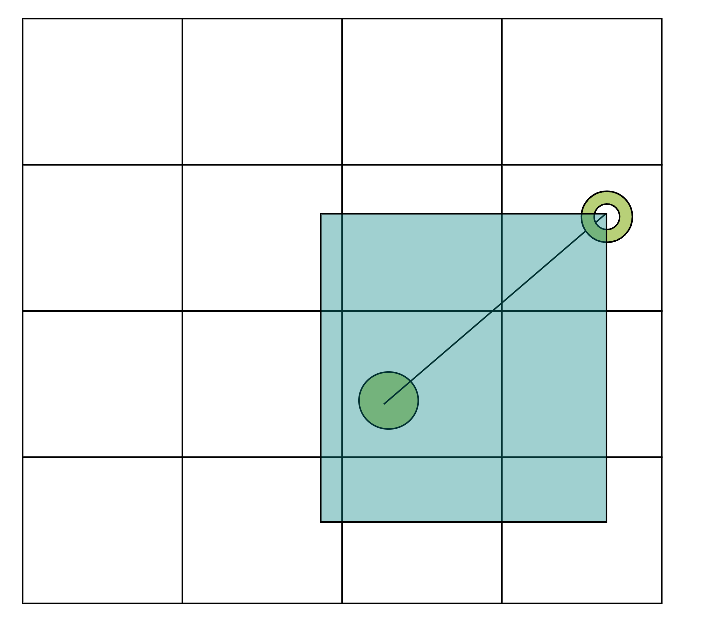

# vst_chunks
A simple API for loading chunks around the computer.

## Namespaces
* `vst_chunks`

## Functions
### start
`start(priority: number, chunkVec: {x: number, z: number})`

Starts chunk-loading.

Will load all chunks in the rectangle of the computer's position and
the given `chunkVec` (relative to the computer's position) every tick.

The `priority` specifies the priority of the chunk-loading.
The higher this integer is, the higher the priority.

### stop
`stop()`

Stops chunk-loading.

### help
`help()`

Returns a short summary of the API.

## Other information

The green full circle is the current position of the computer.

The green circle with a hole is the `chunkVec` (relative to the computer's position).

The blue rectangle is all the chunks that should be loaded.